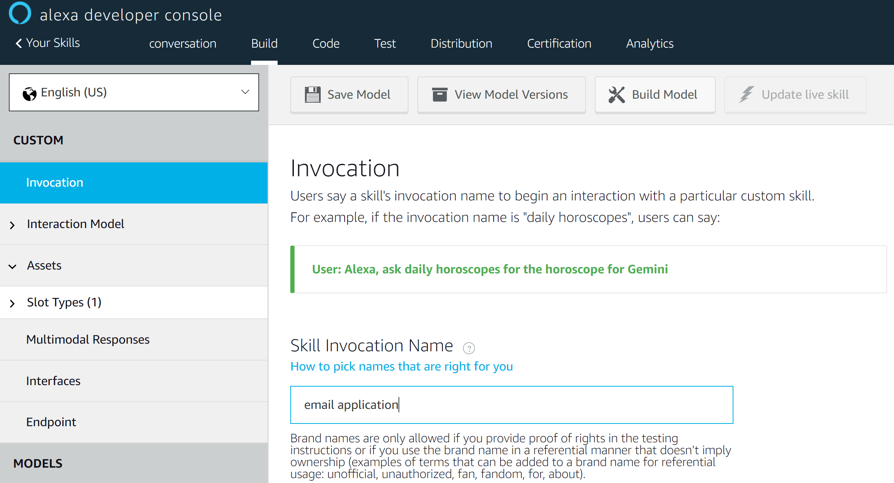
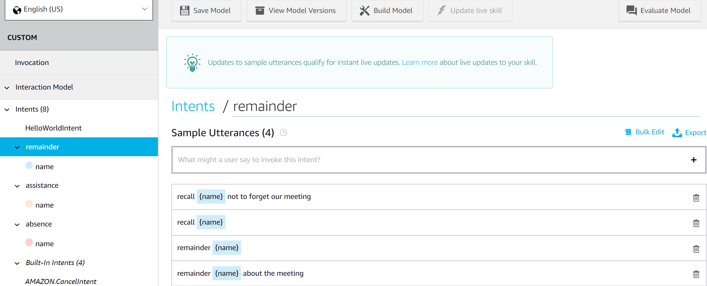

# Alexa

Amazon Alexa, also known simply as Alexa, is a virtual assistant AI technology developed by Amazon. It is capable of voice interaction and can also control several smart devices using itself as a home automation system [[1]](https://en.wikipedia.org/wiki/Amazon_Alexa).

## Alexa skills

Amazon allows developers to build and publish skills for Alexa using the Alexa Skills Kit known as Alexa Skills. These third-party-developed skills, once published, are available across Alexa-enabled devices [[2]](https://en.wikipedia.org/wiki/Amazon_Alexa#Alexa_Skills_Kit).

## How to

**0.** If you don’t have an [Amazon Developer account](https://developer.amazon.com), create a free one.

**1.** Go to the [Amazon Developer Console](https://developer.amazon.com/alexa/console/ask) and create an application by clicking on *"Create Skill"* and following the instructions. Select *Custom* to develop an app from scratch.

**2.** In the *Build* section, select *Invocation* and write a phrase by which a person could trigger this particular skill.

**3.** Intents are kind of the actions that your Alexa skill performs. In the left hand menu, select *Intent* then *Add* to create a custom intent. Define sample utterances with which users can call up this intent. Preferably [[3]](https://www.ionos.com/digitalguide/online-marketing/online-sales/create-alexa-skills/) add around 30 samples to allow the deep learning algorithm behind Alexa skill to train efficiently and therefore detect this intent in various situations.

:warning: Do not forget to save model and build model every time you make changes to the model.

**4.** Select *Endpoint* in the left hand menu, then add a web service https link to your backend application as in [this example](./alexa_emails/).
