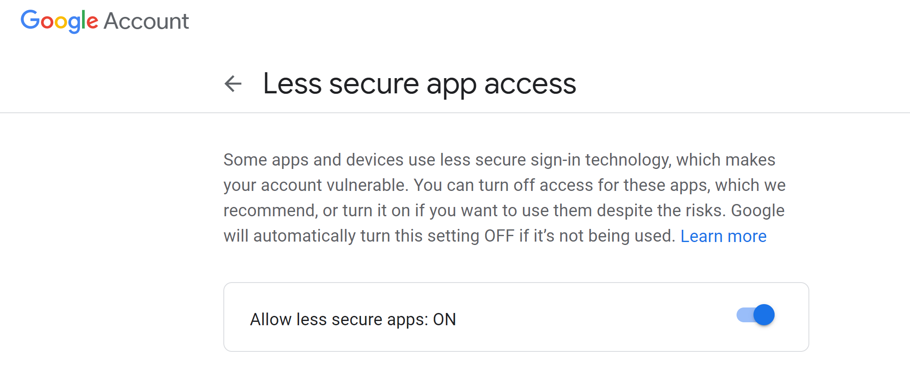

# Alexa skills : Send proper emails to your employees

Thanks to this skill, you'll be able to send emails to your employees using Alexa. Sending emails was never as easy as it is now !

### Database

You have to have a database that matches :

**1.** The names of your employees with their email addresses

**2.** The subject of the email with the content you want to sender

For the sake of simplicity, we just used [python dictionaries](./db.py)

### Gmail configuration

In order to send emails via python we used the library [smtplib](https://docs.python.org/3/library/smtplib.html) with Google's Gmail service. To do so you have to configure the sender email to allow your code to interact with it.

Go to Gmail's [Less Secure App setting](https://myaccount.google.com/lesssecureapps) and allow third party apps by switching to ON, as shown in the following figure.



The login and password are in another [file](./config.py). Keep in mind this is for learning purposes, we do not recommend managing authentication this way in production.

### Sending emails

The file [alexa_emails.py](./alexa_emails.py) contains the functions used to interact with the db and send the appropriate email given a name and a subject.

### Flask Ask App

[Flask-Ask](https://flask-ask.readthedocs.io/en/latest/) makes it easier to build Alexa skills.

Try to install flask-ask using this command to avoid some dependency issues:
```
pip install https://github.com/johnwheeler/flask-ask/archive/master.zip
```

The code in [app.py](./app.py) is self explanatory.

You can use Flask with Ngrok (or Heroku to even get rid of your machine), look at my previous projects [1](https://github.com/aissam-out/chatbot/tree/master/whatsapp#get-a-public-address-to-the-app-using-ngrok) [2](https://github.com/aissam-out/ML-in-production) for further information about that.

### How to

After running [app.py](./app.py) and Ngrok, you will get an **https** address that you have to copy and paste in the Endpoint of your Alexa skill in the Amazon Developer Console, as we have seen [previously](../README.md).
